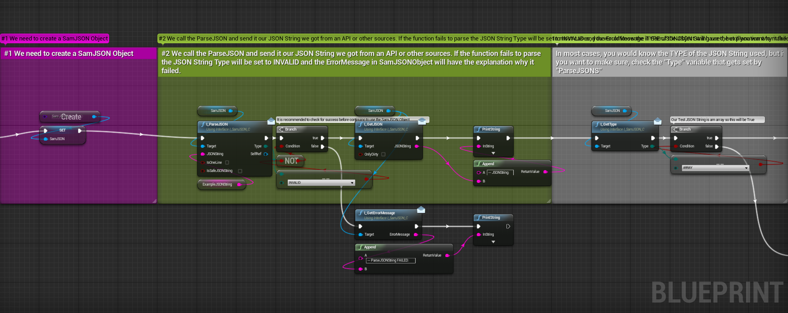
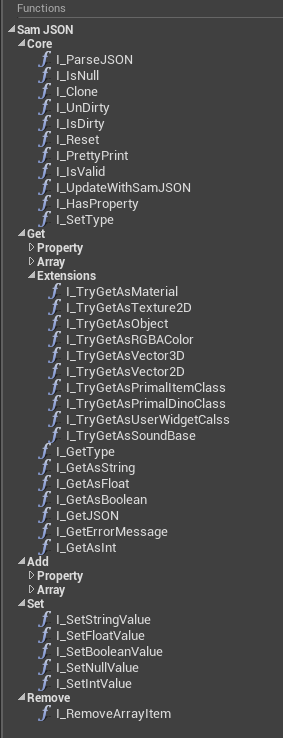
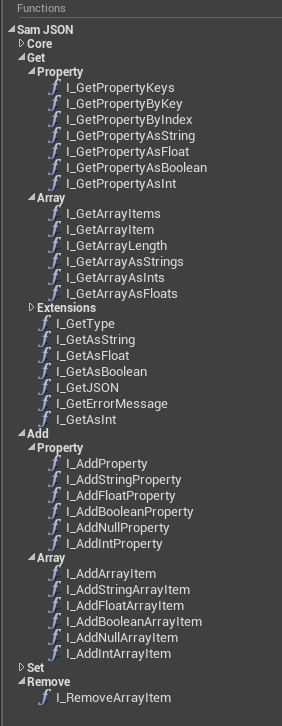
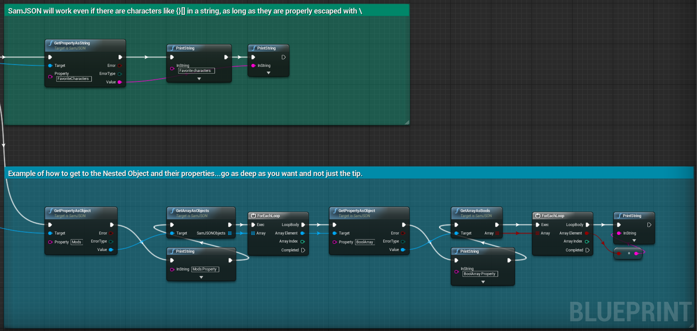
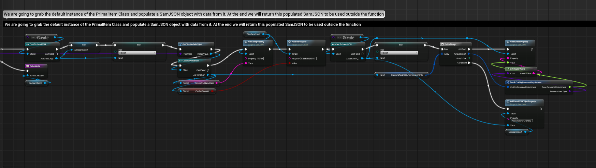

# SamJSON
> UnrealEngine Graphs based JSON Library

SamJSON is a JSON Library that was created to be used by Modders of UnrealEngine based games like ARK and ATLAS where there is no access to the source code and all functionalities need to be implemented using the Blueprints Graphs System.

## Features
* You can **Parse a JSON String into a SamJSON Object** and get all the Properties or Array Items from it using the provided _GetPropertyAsX/GetArrayAsX_ functions
* You can **Create a new empty SamJSON Object**, populate it with data using one of the _AddXProperty/AddXToArray_ functions and **generate a JSON string** out of it by calling _GetJSON_
* You can **Change values of Properties** of a existing SamJSON object by using the provided _AddXProperty_ functions or _GetProperty_ + _SetXValue_
* Dirty Properties - generate a JSON string that contain only properties that had their values changed after the initial parse
* PrettyPrint - generate a nicely formated JSON string to print to logs, console or UI

## Getting Started

These instructions will get you a copy of the assets needed to use SamJSON in your own Mod Project.

### Prerequisites

UnrealEngine (Full or the DevKit of one of the supported games)

### Installing

* Clone or Download the assets from Git
* Copy the folder ArkZeroRP to your "Mods" folder so that you have the following structure "*/Game/Mods/ArkZeroRP/Standalone/SamJSON/*"
* Start your Engine/DevKit and navigate to "/Game/Mods/ArkZeroRP/Standalone/SamJSON" (you should see 3 Blueprints and 1 Folder)
* Done

### Asset List (BP - Blueprint)

* /ArkZeroRP/Standalone/SamJSON/I_SamJSON.uasset - :red_circle:REQUIRED
  >Interface BP, Exposes all the functionalities of the SamJSON Library allowing you to pass the SamJSON object as an Object reference instead of SamJSON hard reference
* /ArkZeroRP/Standalone/SamJSON/SamJSON.uasset - :red_circle:REQUIRED
  >The library BP based of Object
* /ArkZeroRP/Standalone/SamJSON/SamJSON_ExampleSingleton.uasset - :large_blue_circle:OPTIONAL
  >Examples singleton BP based of Actor
* /ArkZeroRP/Standalone/SamJSON/Enums/SamJSON_Type.uasset - :red_circle:REQUIRED
  >Enum BP, possible types of JSON Data
* /ArkZeroRP/Standalone/SamJSON/Enums/SamJSON_ValueErrorType.uasset - :red_circle:REQUIRED
  >Enum BP, possible types of Errors when using GetPropertyAsX

### Usage example

* Open "SamJSON_ExampleSingleton" to see examples of how to use the "SamJSON" Blueprint that is the JSON Library itself
* (ARK/ATLAS)You can add "SamJSON_ExampleSingleton" to your singletons list in the PrimalGameData to execute it in PIE and see the examples in action

Parse a JSON String into SamJSON Object and query Properties

Create a new SamJSON Object and populate it with data

## Release History
* 21.07.2019
	* Added new I_ParseJSON_Native (20x Faster) that uses the Native Json Parser to parse the data, but needs a JSON Structure string to let SamJSON know of how the JSON is built.
    * Added some small additions in removing items and properties
    * Added Parent tracking (know to which object a property belongs to or to which Array)
	* Small performance improvements inside the SamJSON BP
* 09.03.2019
	* Major rework on the parsing logic to follow the JSON standards and increase parsing success over 99%
	* ADD: Interface for the Library allowing to pas SamJSON as an Object reference and eliminating the need of casting it to SamJSON
	* ADD: Bunch of Get Extensions making it easier to convert SamJSON Values in MaterialInstances, Textures, Colors,...
* 08.02.2019
	* Major rework on the parsing logic to follow the JSON standards and increase parsing success over 95%
	* FIX: Failing to parse valid JSON with escaped characters 
	* FIX: Escaping and Un-Escaping of string values
	* ADD: A simple "Dirty" concept to properties of an object and GetDirtyyJSONString to generate a JSON containing only changed properties
	* ADD: Indexing of stings which increases success rate to >95% but has also impact on performance with large JSON Data
	* ADD: Options for ParseJSONString to turn on/off features which change speed and quality of parser
* 04.02.2019
	* CHANGE: Improvements to the README.md
* 02.02.2019
	* Full rework of the Library (more functional and organized)
	* FIX: Infinity Loops with nested arrays
	* FIX: Support for escaped characters
	* ADD: Example Singleton for testing the Library out and understanding how to use it
	* ADD: Tool-tips and Descriptions for all functions and variables as well as comments in the graphs where needed (Examples)
	* CHANGE: Categories of functions and variables for easier use and understanding

## Meta

**Samir (SamKO) Šupčić** – [ArkZeroRP](https://arkzerorp.com/) - [@SamKO_ArkZero](https://twitter.com/SamKO_ArkZero) - [@SamirSupcic](https://twitter.com/SamirSupcic)

This project is licensed under the MIT License - see the [LICENSE.md](LICENSE.md) file for details

## Contributing

1. Fork it (<https://github.com/SamKO91/ArkZeroRP_SamJSON>)
2. Create your feature branch (`git checkout -b feature/fooBar`)
3. Commit your changes (`git commit -am 'Add some fooBar'`)
4. Push to the branch (`git push origin feature/fooBar`)
5. Create a new Pull Request

## Acknowledgments

* Hat tip to the good people at the ARK and ATLAS Modding Community
* **@Ghazlawl** (ARK and ATLAS Modding Community) for testing and providing good feedback

